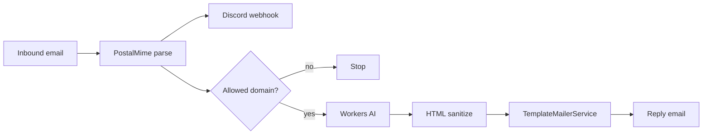

🇪🇸 [Español](README.md) | 🇬🇧 English

<div align="center">
  
  <h1>Proyecto Grand Order - Email Support Agent</h1>
  <p>Support agent that replies to helpdesk emails with Workers AI and HTML templates.</p>

  
  
  
  
</div>

## Description

Support agent for Proyecto Grand Order. It receives emails, posts a summary to Discord, and generates an automated reply based on the official project documentation. Replies are sent as HTML using email templates.

## Flow



## Features

- Email reception with Cloudflare Email Workers
- Parsing with PostalMime and attachment extraction
- Discord notification via webhook
- AI reply with Workers AI (text and vision)
- HTML sanitization before sending
- Production-ready HTML email templates

## Configuration

Key variables and bindings in `wrangler.jsonc`:

- `ALLOWED_EMAILS_DOMAINS`: comma-separated list
- `DISCORD_WEBHOOK_URL`: Discord webhook URL
- `EMAIL`: email sending binding
- `AI`: Workers AI binding

When you change bindings, run:

```bash
pnpm cf-typegen
```

## AI Models

- Text: `@cf/meta/llama-3.1-8b-instruct`
- Vision: `@cf/llava-hf/llava-1.5-7b-hf`

## Scripts

```bash
pnpm dev       # local development
pnpm deploy    # deploy to Cloudflare
pnpm test      # tests
```

## Resources

- Official site: https://proyectograndorder.es
- Documentation: https://proyectograndorder.es/docs
- Bug reports: https://bugs.proyectograndorder.es/
- Discord: https://discord.gg/fate-go-esp
