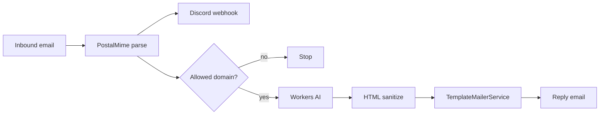

<div align="center">
  
  <h1>Proyecto Grand Order - Email Support Agent</h1>
  <p>Agente para responder correos electronicos de soporte con Workers AI y plantillas HTML.</p>

  
  
  
  
</div>

## Descripcion

Agente de soporte para Proyecto Grand Order. Recibe correos, los resume para Discord y genera una respuesta automatica con el contenido oficial del proyecto. La respuesta se envia en HTML usando plantillas de email.

## Flujo



## Caracteristicas

- Recepcion de emails con Cloudflare Email Workers
- Parseo con PostalMime y extraccion de adjuntos
- Notificacion a Discord via webhook
- Respuesta con Workers AI (texto y vision)
- Sanitizado de HTML antes de enviar
- Plantillas HTML listas para email

## Configuracion

Variables y bindings clave en `wrangler.jsonc`:

- `ALLOWED_EMAILS_DOMAINS`: lista separada por comas
- `DISCORD_WEBHOOK_URL`: webhook de Discord
- `EMAIL`: binding de envio de correos
- `AI`: binding de Workers AI

Cuando cambies bindings, ejecuta:

```bash
pnpm cf-typegen
```

## Modelos de IA

- Texto: `@cf/meta/llama-3.1-8b-instruct`
- Vision: `@cf/llava-hf/llava-1.5-7b-hf`

## Scripts

```bash
pnpm dev       # desarrollo local
pnpm deploy    # despliegue a Cloudflare
pnpm test      # pruebas
```

## Recursos

- Sitio oficial: https://proyectograndorder.es
- Documentacion: https://proyectograndorder.es/docs
- Reporte de bugs: https://bugs.proyectograndorder.es/
- Discord: https://discord.gg/fate-go-esp
